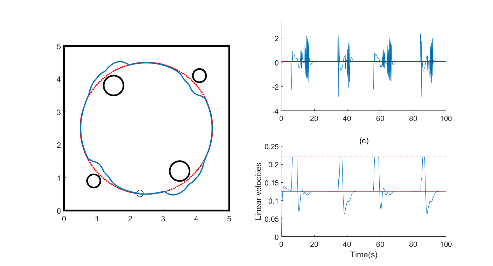

# A collision-free trajectory tracking controller using QL

## intro

This project is an obstacle avoidance trajectory tracking method based on QL (Q-Learning) algorithm. This method utilizes radar data for environment awareness and, combined with a trajectory tracking controller, enables a robot or vehicle to safely and efficiently conduct path planning and tracking in complex environments.

## Mode of operation

Run the script '/code/test_circle.m' in Matlab environment

## Brief introduction of results

In the environment with obstacles, the robot can sense the environment according to radar data and avoid obstacles according to the QL algorithm.

## Instructions

The current version includes only the trained model, not the training code.
The full training code will be released in a future release.
